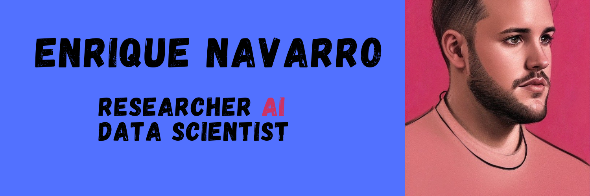

I am an artificial intelligence researcher who is passionate about solving problems. In this repository you can find multiple projects, written in python, that show how to apply AI to different scenarios. 

## Contact me 
If you want to contact me, you can write to my email address: [enriquenavarro26@hotmail.com](mailto:enriquenavarro26@hotmail.com)

<!-- load image>

<!--
**EnriqueNavarro26/EnriqueNavarro26** is a ✨ _special_ ✨ repository because its `README.md` (this file) appears on your GitHub profile.

Here are some ideas to get you started:

- 🔭 I’m currently working on ...
- 🌱 I’m currently learning ...
- 👯 I’m looking to collaborate on ...
- 🤔 I’m looking for help with ...
- 💬 Ask me about ...
- 📫 How to reach me: ...
- 😄 Pronouns: ...
- ⚡ Fun fact: ...
-->
